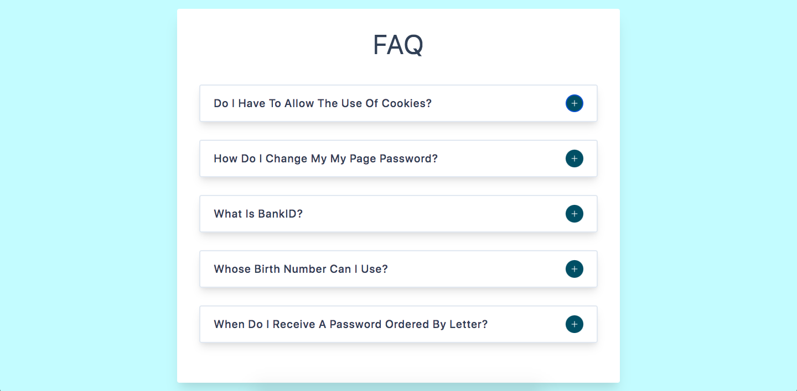

# FAQ Questions



## Project Description

This `react.js` project is designed to create a dynamic FAQ page where users can view a list of questions and toggle the corresponding answers. 

It utilizes `HTML` and `CSS` for styling purposes, providing an organized and visually appealing layout for the FAQ content. Users can expand and collapse the answers by clicking on the question, allowing for an interactive and user-friendly experience.

## Important Links

- 

### Setup Steps

1. [Fork and Clone](https://github.com/iamatos3/faq-questions) this repository.
2. ```npm install```
3. ```npm run dev```

### Technologies Used

- Vite
- React.js
- HTML
- CSS